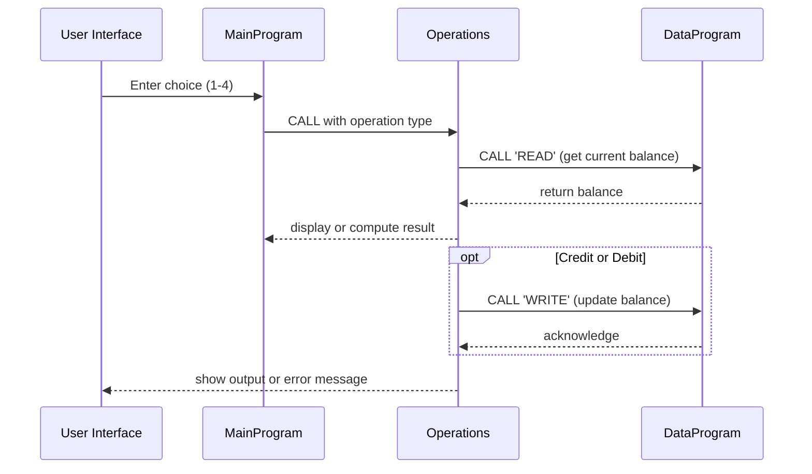

# COBOL Account Management Documentation

This document provides an overview of the COBOL programs contained in the `src/cobol` directory. Each file implements part of a simple account management system, originally intended for handling student accounts.

---

## File Descriptions

### `main.cob`
- **Purpose**: Acts as the user interface and control flow for the application.
- **Key Functions**:
  - Displays a menu with options to view balance, credit an account, debit an account, or exit.
  - Accepts user input and dispatches requests to the `Operations` program via `CALL` statements.
- **Business Rules**:
  - Repeats the menu until the user selects the exit option.
  - Validates choice to be within 1–4 and prompts again on invalid input.

### `operations.cob`
- **Purpose**: Implements the business logic for account operations.
- **Key Functions**:
  - Receives an operation type (`TOTAL`, `CREDIT`, or `DEBIT`) from `main.cob`.
  - Handles reading the current balance, performing credits and debits, and enforcing rules.
  - Communicates with `DataProgram` for persistent storage reads/writes.
- **Business Rules**:
  - **View Balance (`TOTAL`)**: Calls `DataProgram` to read and display the current balance.
  - **Credit Account (`CREDIT`)**: Prompts for amount, adds to balance, writes updated value.
  - **Debit Account (`DEBIT`)**: Prompts for amount and ensures sufficient funds exist before subtracting; if funds are insufficient, a warning is displayed and the balance remains unchanged.
  - The initial `FINAL-BALANCE` starts at `1000.00` but is updated from storage on each operation.

### `data.cob`
- **Purpose**: Acts as a simple in-memory data store for the account balance.
- **Key Functions**:
  - Provides `READ` and `WRITE` entry points for other programs via `CALL`.
  - Maintains a working-storage `STORAGE-BALANCE` value representing the stored account balance.
- **Business Rules**:
  - `READ` returns the current `STORAGE-BALANCE` without modification.
  - `WRITE` updates `STORAGE-BALANCE` with the passed-in balance value.
  - It simulates persistent storage, which could later be replaced with file or database logic.

---

## Student Account Considerations

While the code itself does not explicitly reference students, it was designed with student account management in mind. Business rules generally include:

1. **Starting Balance**: Each account initializes to a default of $1,000.00.
2. **Sufficient Funds Check**: Debit operations must check that the requested amount does not exceed the stored balance.
3. **Stateless Calls**: The programs interact via parameter passing rather than shared global data, which simplifies tracking individual student balances if extended.
4. **Extendibility**: Future enhancements might add student identifiers, transaction logs, or integration with a real database.

---

*This documentation should serve as a reference for developers who need to modernize or extend the legacy COBOL codebase.*

---

## Sequence Diagram

